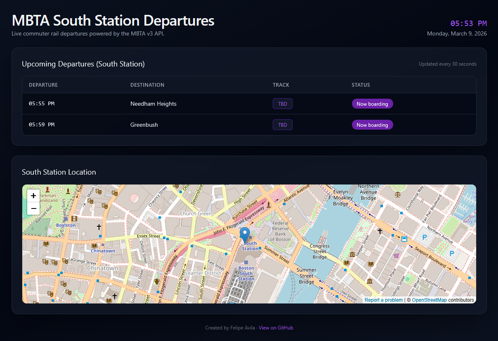

# MBTA South Station Tracker



## Description

This project is a React single-page application that displays live commuter rail departure information for **South Station (Boston, MA)** using the official **MBTA v3 API**.  
On load, the app queries the MBTA `predictions` endpoint, filtered to the South Station stop (`place-sstat`) and commuter rail route type, and periodically refreshes this data to keep the dashboard up to date.

For each upcoming train departure, the application shows:

- **Current time and date** (always visible in the header)
- **Scheduled departure time**
- **Train destination** (from the trip headsign / route information)
- **Track number** (platform code)
- **Train status** (e.g., On time, Boarding, Delayed)
- A **location card** with an embedded OpenStreetMap view centered on South Station


## Usage

1. **Clone the repository**:
   ```bash
   git clone https://github.com/favila2002/MBTA-South-Station-Tracker.git
   cd MBTA-South-Station-Tracker
   ```
2. **Install dependencies**:
   ```bash
   npm install
   ```
3. **Create a `.env` file** at the project root and add your MBTA API key:
   ```bash
   VITE_MBTA_API_KEY=your_mbta_api_key_here
   ```
4. **Start the development server**:
   ```bash
   npm run dev
   ```
5. **Open the app in your browser** at the URL printed in the terminal to view the live South Station departures dashboard.

## Credits

- **MBTA v3 API** – live transit data for South Station predictions and trip information  
  Documentation: [`https://api-v3.mbta.com/docs/swagger/index.html#/`](https://api-v3.mbta.com/docs/swagger/index.html#/)
- **React** – component-based UI library for building the dashboard
- **Vite**
- **Tailwind CSS** 
- **OpenStreetMap** 